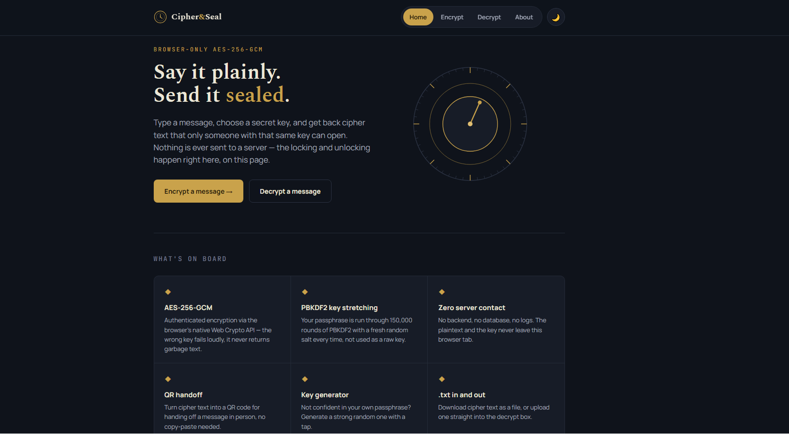
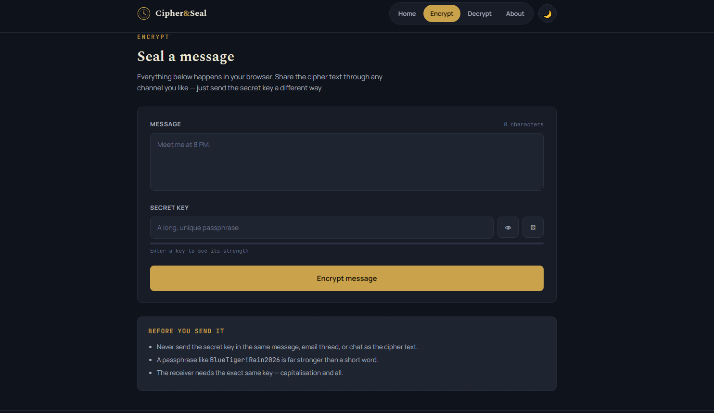
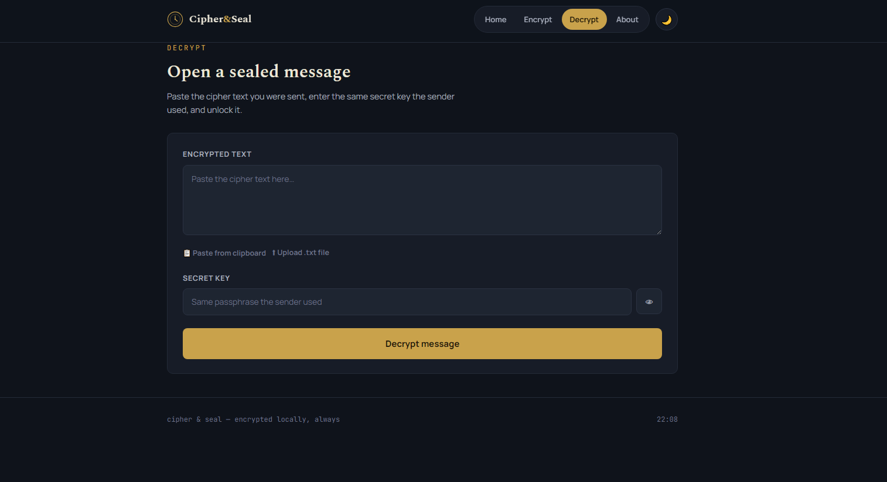

<<<<<<< HEAD
# Cipher & Seal

A secure browser-based message encryption application that encrypts and decrypts messages locally using the Web Crypto API.

## Features

- AES-256-GCM Encryption
- PBKDF2 Key Derivation
- Browser-only Encryption
- QR Code Generation
- Strong Password Generator
- Dark/Light Theme
- Copy & Download Encrypted Messages

## Technologies

- HTML5
- CSS3
- JavaScript
- Web Crypto API

## Getting Started

No build step, no dependencies to install.

```bash
# clone or unzip the project, then from inside the folder:
python3 -m http.server 8000
# open http://localhost:8000
```

Opening `index.html` directly by double-clicking also works — the only exception is the "Paste from clipboard" button on the decrypt page, which browsers restrict to HTTPS/localhost, so paste manually with Ctrl/Cmd+V in that case.

## Project Structure

```
Cipher-Seal/
├── index.html
├── encrypt.html
├── decrypt.html
├── about.html
├── css/
│   └── style.css
└── js/
    ├── crypto.js
    ├── decrypt.js
    ├── encrypt.js
    └── utils.js
```

## Live Demo

Coming Soon

## Screenshot

**Home**


**Encrypt**


**Decrypt**


## Author

Sanjay S

## License

MIT — see `LICENSE`.
=======
# cipher-seal
A browser-based AES-256 message encryption and decryption web application built with the Web Crypto API.
>>>>>>> 7619ab4f9e39a1adb49f8e91554be83d93093b65
